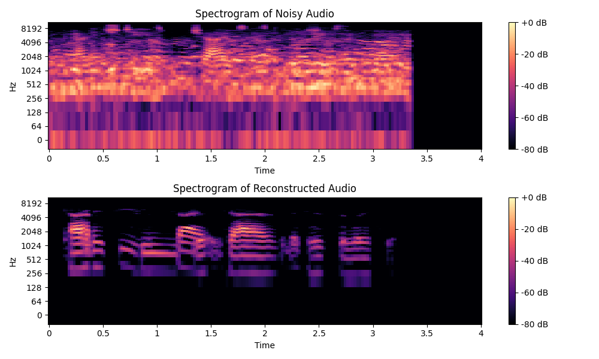

# Noise reduction and accuracy improver of a Speech Recognition machine learning model.

# Summary/Objective (Machine Learning)
Noise reduction and accuracy improver of a Speech Recognition machine learning model. Modern software can reduce noise at a certain level. We will be trying to incorporate reduction of background noise including hums, chatter, and street noise to provide a good quality clear audio output with top most accuracy. We will also train the model with audio datasets to improve the efficiency of the model at real time speech recognition.  

 
**Challenge:** Accuracy is the main challenge that is being faced in this market of speech recognition. Even Google sometimes misinterprets what a person is actually saying. The accuracy also hinders due the background noise while a person is speaking. So to reduce the noise in order to have a crystal clear audio is what we will be trying to do in this project.

# Current Structure
The project aims to train a learning model on an audio dataset and remove the noise from a given input audio using the learned model. The project achives this goal in the following steps:
1. Get a list of the noisy audio and clean audio
2. Extract the Melspectrogram (important audio feature) from both the noisy and clean audio files
3. Arrange the noisy and clean melspectrograms into a vector format, where the noisy melspectrograms are the features and the clean melspectrograms are lables. The vector should look like this:

$x_{noisy} = 
\begin{bmatrix} noisy_{1} \\\ noisy_{2} \\\ ... \\\ noisy_{n}
\end{bmatrix}$ $y_{clean} = 
\begin{bmatrix} clean_{1} \\\ clean_{2} \\\ ... \\\ clean_{n}
\end{bmatrix}$

$data = 
\begin{bmatrix} noisy_{1},clean_{1} \\\ noisy_{2},clean_{2} \\\ ... \\\ noisy_{n},clean_{n}
\end{bmatrix}$ *Where $n$ is the number of samples*

4. With our dataset we create a model using a learning algorithm such that we have a mapping of noisy features to clean labels:
$f(noisy)$ &#8594; $clean$
From our implemntation we have KNN, Random Forest bagging, and Linear Regression

5. After obtaining our model we run the audio that we wan to remove noise from with our model:
$model(noisy_{input})$ &#8594; $clean_{target}$

6. We print the predicted melspectrum data and reconstruct an audio file using that melspectrum. If the noise was successfuly removed, we should get a melspectrum that looks like so: 


# Prerequisites
- A Windows 10 or Mac OS computer
- `Python 2.7xx` or higher
- Python modules: `Librosa`, `SciPy`, `PyDub`, `SoundFile`, `numpy`, and `pandas` 

# How to Run / Usage
 dev
1. Clone the repository or download the files to your local machine.

2. Install the required libraries if you haven't already:
   ```bash
   pip install scikit-learn matplotlib numpy SoundFile Librosa
   ```

3. Navigate to the directory where the files are located.

4. Run the program using the following command:

    ```bash
   python main.py
   ```

   OR you can specify specific paramaters

   ```bash
   python main.py --data <path_to_dataset> --max <max_audio_length> --sr <sample_rate> --g <gender> --st <sound_type> --a <learning_algorithm> --v <verbose_flag> --n <k_neighbors> --e <n_estimators> --i <input_path>
   ```

   Where:
   - `<path_to_dataset>`: Path to your dataset directory. Default: './sample-data/'
   - `<max_audio_length>`: Maximum audio length of your entire dataset. Default: 4
   - `<sample_rate>`: Sample rate of audio. Default: 22050
   - `<gender>`: Gender of the person speaking. Choices: 'male', 'female', 'both'. Default: 'both'
   - `<sound_type>`: Type of sound - 'sentence', 'digit', or 'both'. Default: 'both'
   - `<learning_algorithm>`: Learning algorithm to use. Choices: 'knn', 'rfb', 'lrg'. Default: 'knn'
   - `<verbose_flag>`: Verbosity flag (True or False). Default: False
   - `<k_neighbors>`: Number of neighbors for KNN algorithm. Default: 1
   - `<n_estimators>`: Number of estimators for Random Forest Boosting algorithm. Default: 100
   - `<input_path>`: Path to input file. Default: './sample-data/dm1_n0H.wav'

5. The Program should then execute and save a new audio file called `target_audio.wav` which is your denoised audio

# Background Information
#### What is a Melspectrogram?
A mel spectrogram, short for mel-frequency spectrogram, is a representation of the spectrum of a signal as it varies over time. To create a melspectrogram you split the signal into short segments, typically using a technique like the Fast Fourier Transform (FFT). Each segment represents a snapshot of the signal's frequency content at a particular moment in time. The freequency is then converted to a scale that represents human hearing (Mel-scale). Then the power of each frequency is represented by decibels.

#### What is a Sample Rate?
Sample rate refers to the number of samples of audio captured per second, typically measured in hertz (Hz). It determines the fidelity with which analog audio is converted into a digital format.For example, a sample rate of 44.1 kHz means that 44,100 samples are taken per second to represent the audio signal. In out project, the dataset had a sample rate of 22,050


#### Where did we get the dataset?
The data set can be found at: https://www.ee.columbia.edu/~dpwe/sounds/ and is in the public domain and originates from the University of Columbia

#### What if the audios are NOT the same length?
If the audio lengths are not the same length, we pad the audio using the length of the longest audio clip in the dataset. Padding typically refers to adding silence or zeros to the beginning or end of an audio signal to adjust its length or to facilitate certain operations such as Fourier transforms.
ng.
=======
- Clone or download this repository
- Type `python main.py` into your terminal.
 main

## Authors
- Aman Hogan-Bailey
- Divya Tejasbha Shah
- Karan Bhavin Shah

## Contributions and Referenes
- The University of Texas at Arlington
- Columbia University (Dataset) : https://www.ee.columbia.edu/~dpwe/sounds/
